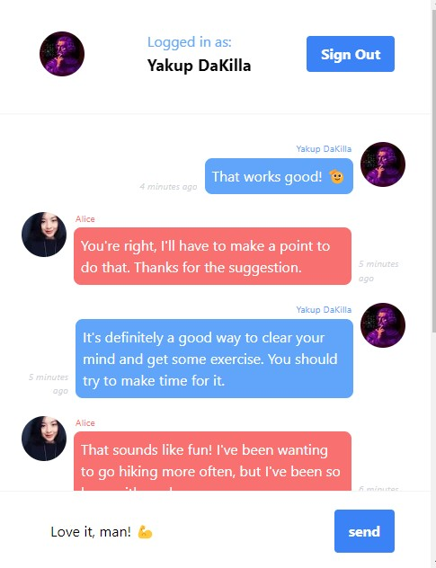

<p align="center">
  <a href="https://github.com/sextus-empiricus/next13-messenger">
    
  </a>

<h3 align="center">META Messenger</h3>

  <p align="center">
    Let’s build META Messenger 2.0 with Next.js 13 (Upstash, TypeScript, Redis, Tailwind, NextAuth)
    <br>
  </p>
</p>



## Next.js 13 - Meta Messenger

> Let’s build META Messenger 2.0 with Next.js 13 (Upstash, TypeScript, Redis, Tailwind, NextAuth)

### Tutorial info

|            | `                                                                                                   |
|------------|-----------------------------------------------------------------------------------------------------|
| `title`    | **Let’s build META Messenger 2.0 with Next.js 13 (Upstash, TypeScript, Redis, Tailwind, NextAuth)** |
| `author`   | [Sonny Sangha](https://www.youtube.com/@SonnySangha)                                                |
| `link`     | [click](https://www.youtube.com/watch?v=T2jKJF4BZOY&ab_channel=SonnySangha)                         |
| `progress` | finished                                                                                            |

### Notes

* Every interactive element should be a client component,
* ```ts 
    interface Props {
      // 🔥 amazing way for getting fn's return type! 
      providers: Awaited<ReturnType<typeof getProviders>>;
    }
    ```

### New tools I worked with

* [Redis](https://redis.io/)
* [Upstash](https://upstash.com/)
* [SWR](https://swr.vercel.app/) (and *optimistic update*)
* [Pusher](https://pusher.com/) ( *pop submodule*)
* [Flowbite](https://flowbite.com/)
